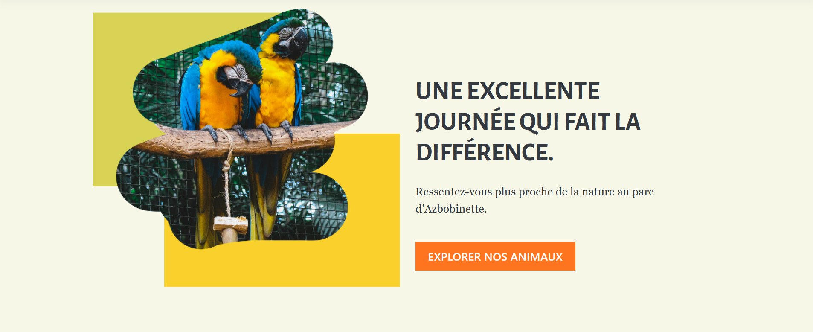
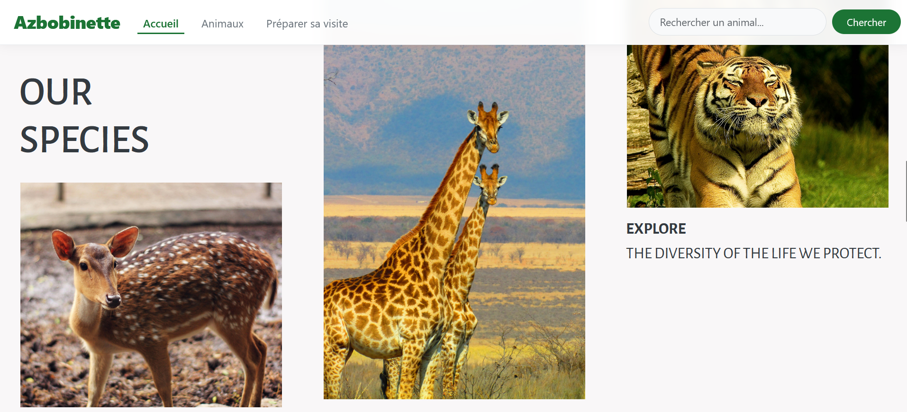
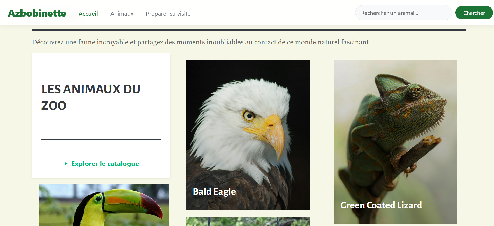

A comprehensive zoo management web application built with a React frontend and Laravel backend. This system allows administrators to manage animals, families, and continents while providing an engaging catalog interface for visitors.
Architecture Overview
Frontend (React)

    Framework: React 19.2.0 with React Router DOM 7.9.5

    UI Library: Bootstrap 5.3.8

    HTTP Client: Axios 1.13.1

    Icons: FontAwesome & Lucide React

    Testing: React Testing Library

Backend (Laravel)

    Framework: Laravel 10.0

    PHP Version: ^8.1

    Authentication: Laravel Sanctum

    Database: MySQL with Eloquent ORM

    API: RESTful API architecture

Project Structure

azbobinette/
├── frontend/                 # React frontend application
│   ├── public/               # Static assets and images
│   ├── src/
│   │   ├── components/       # Reusable UI components
│   │   │   ├── admin/        # Admin-specific components
│   │   │   └── client/       # Client-facing components
│   │   ├── layouts/          # Page layout components
│   │   ├── pages/            # Route components
│   │   │   ├── admin/        # Admin dashboard pages
│   │   │   └── client/       # Public pages
│   │   ├── router/           # Route configuration
│   │   ├── api.js            # API client configuration
│   │   └── App.js            # Main application component
│   └── package.json
├── backend/                  # Laravel backend API
│   ├── app/
│   │   ├── Http/Controllers/ # API controllers
│   │   ├── Models/           # Eloquent models
│   │   └── Providers/        # Service providers
│   ├── database/
│   │   ├── migrations/       # Database schema
│   │   └── seeders/          # Database seeding
│   ├── routes/
│   │   ├── api.php           # API routes definition
│   │   └── web.php           # Web routes
│   ├── composer.json
│   └── vite.config.js
└── README.md

Database Schema
Core Entities
Animals

    id: Primary key

    name: Animal name (varchar 150)

    description: Detailed description (text, nullable)

    family_id: Foreign key to families table

    image_path: Path to stored image (varchar, nullable)

    timestamps: Created and updated timestamps

Families

    id: Primary key

    name: Family name (varchar 100)

    description: Family description (text, nullable)

    timestamps: Created and updated timestamps

Continents

    id: Primary key

    name: Continent name

    timestamps: Created and updated timestamps

Relationships

    animal_continent: Many-to-many pivot table between animals and continents

    Animals → Families: Many-to-one relationship

    Animals → Continents: Many-to-many relationship

🔌 API Endpoints
Authentication

    POST /api/register - User registration

    POST /api/login - User login

    POST /api/logout - User logout (protected)

    GET /api/user - Get current user (protected)

Animals Management

    GET /api/animals - List animals with filtering and pagination

    GET /api/animals/take - Get limited number of animals (4)

    GET /api/animals/{id} - Get specific animal details

    POST /api/animals/create - Create new animal (protected)

    GET /api/animals/edit/{id} - Get animal edit form

    PUT /api/animals/update/{id} - Update animal (protected)

    DELETE /api/animals/delete/{id} - Delete animal (protected)

Families Management

    GET /api/family - List all families

    GET /api/family/{id} - Get specific family

    POST /api/family/create - Create new family (protected)

    GET /api/family/edit/{id} - Get family edit form

    PUT /api/family/update/{id} - Update family (protected)

    DELETE /api/family/delete/{id} - Delete family (protected)

Continents Management

    GET /api/continents - List all continents

    POST /api/continents - Create new continent (protected)

Authentication & Security
Frontend Authentication

    JWT token-based authentication

    Token stored in localStorage

    Automatic token refresh and logout on expiration

    Protected routes with role-based access control

Backend Security

    Laravel Sanctum for API authentication

    CORS configuration for cross-origin requests

    Request validation and sanitization

    File upload security for images

Frontend Features
Client Interface

    Home Page: Hero section, descriptions, categories, and animal collections

    Catalogue: Browseable animal catalog with search and filtering

    About: Information about the zoo

    Responsive Design: Mobile-first approach with Bootstrap

Home Page Gallery

    

Animals Catalog
Admin Dashboard

    Dashboard: Overview cards for animals and families

    Animal Management: CRUD operations for animals

    Family Management: CRUD operations for families

    Authentication: Secure login/logout functionality

UI Components

    Modal: Reusable modal component

    Navbar: Navigation with authentication state

    Loading: Loading state indicators

    Card: Display cards for dashboard items

Development Setup
Prerequisites

    Node.js 18+

    PHP 8.1+

    Composer

    MySQL/MariaDB

    Laravel CLI

Frontend Setup
Bash

cd frontend
npm install
npm start

Backend Setup
Bash

cd backend
composer install
cp .env.example .env
php artisan key:generate
php artisan migrate
php artisan serve

Environment Configuration

    Frontend runs on http://localhost:3000

    Backend API runs on http://127.0.0.1:8000

    API base URL configured in frontend/src/api.js

Data Flow
Client-Server Communication

    Frontend makes HTTP requests via Axios

    Laravel API processes requests with proper authentication

    Eloquent models handle database operations

    Responses returned as JSON with proper status codes

    Frontend updates state and UI accordingly

Authentication Flow

    User submits login credentials

    Backend validates and returns JWT token

    Frontend stores token and adds to request headers

    Protected routes require valid token

    Automatic logout on token expiration

Deployment Considerations
Frontend

    Build optimization with React Scripts

    Static asset optimization

    Environment variable configuration

Backend

    Laravel optimization commands

    Database migration in production

    File storage configuration for uploads

    SSL and HTTPS configuration

Testing
Frontend Testing

    React Testing Library for component testing

    Jest for unit testing

    User interaction testing

Backend Testing

    PHPUnit for API endpoint testing

    Feature testing for CRUD operations

    Database transaction testing

Performance Optimizations
Frontend

    Code splitting with React.lazy

    Image optimization and lazy loading

    Component memoization where appropriate

    Bundle size optimization

Backend

    Database query optimization with eager loading

    API response pagination

    Image storage optimization

    Caching strategies for frequently accessed data
